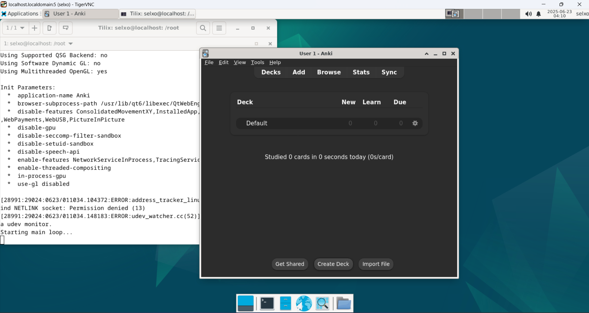

# Anki with Addons on Android: A Comprehensive Guide

> This guide was written by **@1selxo**. You can reach me on Discord if you have better tools or improvements.
>
> **Disclaimer:** The tools used in this guide are not new or original creations. This document aims to be a comprehensive, Android-only guide for Japanese language immersion (and other uses) by enabling the full desktop version of Anki on your device.

The primary goal of this setup is to install and manage **Anki add-ons**, which are not supported by the standard AnkiDroid app. For daily reviews, it is still highly recommended to use **AnkiDroid** after syncing your collection from the desktop client. This setup is for maintenance, card creation with complex add-ons, and management.

## ⚠️ Storage Requirement

> Installing everything in this guide will require a significant amount of storage. It is highly recommended to have a **128GB or 256GB** phone at a minimum before proceeding.

## Prerequisites

Before you begin, you will need to install the following applications on your Android device:

*   **[Termux](https://github.com/termux/termux-app/releases)**: A powerful terminal emulator and Linux environment for Android. It is recommended to install the version from GitHub or F-Droid, not the Play Store, as the Play Store version is outdated.
*   **[RealVNC Viewer](https://play.google.com/store/apps/details?id=com.realvnc.viewer.android)**: A VNC client to access the graphical desktop environment we will be creating.

---

## Step-by-Step Installation Guide

Follow these steps carefully. The process involves setting up a full Debian Linux environment inside Termux.

### Step 1: Install Debian in Termux

First, we'll set up the base Linux environment. Open Termux and run the following commands in order.

1.  **Update Termux packages:**
    ```sh
    pkg upgrade
    ```
2.  **Install `proot-distro` and the Debian distribution:**
    ```sh
    proot-distro install debian
    ```
3.  **Log in to your new Debian environment:**
    ```sh
    proot-distro login debian
    ```
    Your terminal prompt should now change, indicating you are inside Debian.

### Step 2: Set up the Debian Environment

Now, we'll install a desktop environment and create a user account.

1.  **Update Debian's package lists:**
    ```sh
    apt update && apt upgrade
    ```
2.  **Install `sudo`:**
    ```sh
    apt install sudo
    ```
3.  **Install the XFCE4 desktop environment and TigerVNC server:**
    ```sh
    sudo apt install xfce4 tigervnc-standalone-server dbus-x11
    ```
4.  **Create a new user account.** Replace `<your_username>` with a username of your choice.
    ```sh
    adduser <your_username>
    ```
    You will be prompted to create a password and fill in some optional user information.

5.  **Grant your new user `sudo` privileges.** This is a critical step.
    *   Open the sudoers file with the `nano` text editor:
        ```sh
        nano /etc/sudoers
        ```
    *   Using the arrow keys, scroll down until you find the line `root    ALL=(ALL:ALL) ALL`.
    *   Add the following line directly below it, replacing `<your_username>` with the username you created:
        ```
        <your_username> ALL=(ALL:ALL) ALL
        ```
    *   To save and exit, press `Ctrl+X`, then `Y`, then `Enter`.

    
    

6.  **Switch to your new user account:**
    ```sh
    su <your_username>
    ```

### Step 3: Start the VNC Server and Connect

Now we'll start the graphical desktop and connect to it.

1.  **Launch the VNC server:**
    ```sh
    vncserver -xstartup /usr/bin/startxfce4 -localhost no
    ```
    The first time you run this, it will ask you to set a password. **Remember this password.** This is what you will use to connect from RealVNC.

2.  **Connect with RealVNC:**
    *   Open the RealVNC Viewer app on your phone.
    *   Tap the `+` button to create a new connection.
    *   In the "Address" field, enter `localhost:1`.
    *   Give it any name you like.
    *   Connect, and when prompted, enter the password you just set in the terminal.

You should now see a complete XFCE Linux desktop environment on your screen!

### Step 4: Install Anki in the Linux VNC Session

Open a terminal window *inside the Linux desktop you are connected to via VNC*. Now, copy and paste the following commands to install Anki.

1.  **Install Anki's dependencies:**
    ```sh
    sudo apt install python3-pyqt6.qt{quick,webengine,multimedia} python3-venv
    ```
2.  **Create a Python virtual environment for Anki:**
    ```sh
    python3 -m venv --system-site-packages pyenv
    ```
3.  **Upgrade `pip` within the virtual environment:**
    ```sh
    pyenv/bin/pip install --upgrade pip
    ```
4.  **Install Anki (aqt) into the virtual environment:**
    ```sh
    pyenv/bin/pip install --upgrade --pre aqt
    ```
5.  **Run these commands to apply fixes for graphics and library issues:**
    ```sh
    apt-mark hold libpci3
    ```
    ```sh
    echo software > ~/.local/share/Anki2/gldriver6
    ```

### Step 5: Running Anki

To run Anki, you must use a specific command that disables a sandbox feature incompatible with the Termux environment.

1.  **Launch Anki with the required flag:**
    ```sh
    QTWEBENGINE_CHROMIUM_FLAGS="--disable-seccomp-filter-sandbox" pyenv/bin/anki
    ```
    Anki should now launch! You can log in, download your collection, and install any add-ons you need.

2.  **To run Anki in the future:**
    You will need to use the same command every time. To make this easier, consider creating a script.

### Creating a Shortcut (Recommended)

To avoid typing the long command every time, you can create a simple executable script on your Linux desktop.

1.  In the Linux terminal, create a new file:
    ```sh
    nano ~/run-anki.sh
    ```
2.  Paste the following text into the file:
    ```sh
    #!/bin/bash
    QTWEBENGINE_CHROMIUM_FLAGS="--disable-seccomp-filter-sandbox" ~/pyenv/bin/anki
    ```
3.  Save and exit (`Ctrl+X`, `Y`, `Enter`).
4.  Make the script executable:
    ```sh
    chmod +x ~/run-anki.sh
    ```
Now you can simply open a terminal and run `./run-anki.sh` to start Anki, or even create a desktop launcher that executes this script.
