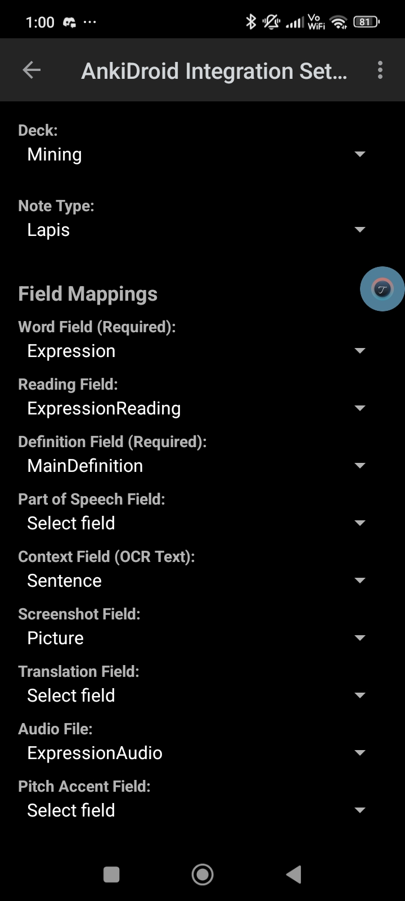

# Anki with Add-ons on Android: A Comprehensive Guide 📱🐧

> This guide was written by **@1selxo**. You can reach me on Discord if you have better tools or improvements.

> **Disclaimer:** The tools used in this guide are not new or original creations. This document aims to be a comprehensive, Android-only guide for Japanese language immersion (and other uses) by enabling the full desktop version of Anki on your device.

## 📚 Table of Contents

*   [🎯 Goal](#-goal)
*   [⚠️ Storage Requirement](#️-storage-requirement)
*   [🛠️ Prerequisites](#️-prerequisites)
*   [Anki with Add-ons on Android: A Comprehensive Guide 📱🐧](#Anki-with-Add-ons-on-Android-A-Comprehensive-Guide-📱🐧)
*   [🚀 Step-by-Step Installation Guide](#-step-by-step-installation-guide)
*   [🎮 VN Mining on Android](#-vn-mining-on-android)
*   [📖 Reading and Mining LNs on Android](#-reading-and-mining-lns-on-android)
*   [🎨 Reading and Mining Manga on Android](#-reading-and-mining-manga-on-android)
*   [🎬 Reading and Mining Anime on Android](#-reading-and-mining-anime-on-android)
*   [🪄 Hacks That Make Everything Easier](#-hacks-that-make-everything-easier)
*   [⚡ Very, Very Optional: Run Local Audio Sync Server on Android](#️-very-very-optional-run-local-audio-sync-server-on-android)

---

## 🎯 Goal

The primary goal of this setup is to install and manage **Anki add-ons**, which are not supported by the standard AnkiDroid app.

For daily reviews, it is still **highly recommended to use AnkiDroid** after syncing your collection from the desktop client. This setup is for maintenance, card creation with complex add-ons, and management.

---

## ⚠️ Storage Requirement

> Surprisingly not much anymore

---
### quick note this is a Linux installation, basically an entire PC on your phone if you really want you can do most simple tasks on this if you know your way around Linux and can even install a browser with yomitan and use ankiconnect and mine with it (untested) but I'd recc do as much Android native tasks as possible also Ankidroid has announced incoming addon support you can skip right to immersion content 

## 🛠️ Prerequisites

Before you begin, you will need to install the following applications on your Android device:

*   **[Termux](https://f-droid.org/en/packages/com.termux/)**: A powerful terminal emulator and Linux environment for Android.
    *   *It is recommended to install the version from [GitHub](https://github.com/termux/termux-app/releases) or [F-Droid](https://f-droid.org/en/packages/com.termux/), not the Play Store, as the Play Store version is outdated.*
*   **[RealVNC Viewer](https://play.google.com/store/apps/details?id=com.realvnc.viewer.android)**: A VNC client to access the graphical desktop environment we will be creating.

---

## 🚀 Step-by-Step Installation Guide

Follow these steps carefully. The process involves setting up a full Debian Linux environment inside Termux.

### Step 1: Install Debian in Termux

First, we'll set up the base Linux environment. Open **Termux** and run the following commands in order.

1.  **Update Termux packages:**
    ```bash
    pkg upgrade
    ```

2.  **Install `proot-distro` and the Debian distribution:**
    ```bash
    proot-distro install debian
    ```

3.  **Log in to your new Debian environment:**
    ```bash
    proot-distro login debian
    ```
    > Your terminal prompt should now change, indicating you are inside Debian.

### Step 2: Set up the Debian Environment

Now, we'll install a desktop environment and create a user account.

1.  **Update Debian's package lists:**
    ```bash
    apt update && apt upgrade
    ```

2.  **Install `sudo`:**
    ```bash
    apt install sudo
    ```

3.  **Install the XFCE4 desktop environment and TigerVNC server:**
    ```bash
    sudo apt install xfce4 tigervnc-standalone-server dbus-x11
    ```

4.  **Create a new user account.** Replace `<your_username>` with a username of your choice.
    ```bash
    adduser <your_username>
    ```
    > You will be prompted to create a password and fill in some optional user information.

5.  **Grant your new user `sudo` privileges.** This is a critical step.
    *   Open the `sudoers` file with the `nano` text editor:
        ```bash
        nano /etc/sudoers
        ```
    *   Using the arrow keys, scroll down until you find the line `root    ALL=(ALL:ALL) ALL`.
    *   Add the following line directly below it, replacing `<your_username>` with the username you created:
        ```
        <your_username> ALL=(ALL:ALL) ALL
        ```
    *   To save and exit, press **Ctrl+X**, then **Y**, then **Enter**.

6.  **Switch to your new user account:**
    ```bash
    su <your_username>
    ```

### Step 3: Start the VNC Server and Connect

Now we'll start the graphical desktop and connect to it.

1.  **Launch the VNC server:**
    ```bash
    vncserver -xstartup /usr/bin/startxfce4 -localhost no
    ```
    > The first time you run this, it will ask you to set a **password**. Remember this password. This is what you will use to connect from RealVNC.

2.  **Connect with RealVNC:**
    *   Open the **RealVNC Viewer** app on your phone.
    *   Tap the **`+`** button to create a new connection.
    *   In the "Address" field, enter `localhost:1`.
    *   Give it any name you like.
    *   Connect, and when prompted, enter the password you just set in the terminal.

You should now see a complete XFCE Linux desktop environment on your screen!

### Step 4: Install Anki in the Linux VNC Session

Open a terminal window inside the Linux desktop you are connected to via VNC. Now, copy and paste the following commands to install Anki.

1.  **Install Anki's dependencies:**
    ```bash
    sudo apt install python3-pyqt6.qt{quick,webengine,multimedia} python3-venv
    ```

2.  **Create a Python virtual environment for Anki:**
    ```bash
    python3 -m venv --system-site-packages pyenv
    ```

3.  **Upgrade pip within the virtual environment:**
    ```bash
    pyenv/bin/pip install --upgrade pip
    ```

4.  **Install Anki (`aqt`) into the virtual environment:**
    ```bash
    pyenv/bin/pip install --upgrade --pre aqt
    ```

5.  **Run these commands to apply fixes for graphics and library issues:**
    ```bash
    apt-mark hold libpci3
    echo software > ~/.local/share/Anki2/gldriver6
    ```

### Step 5: Running Anki

To run Anki, you must use a specific command that disables a sandbox feature incompatible with the Termux environment.

*   **Launch Anki with the required flag:**
    ```bash
    QTWEBENGINE_CHROMIUM_FLAGS="--disable-seccomp-filter-sandbox" pyenv/bin/anki
    ```
    Anki should now launch! You can log in, download your collection, and install any add-ons you need.

*   **To run Anki in the future:**
    You will need to use the same command every time. To make this easier, consider creating a script.

### 💡 Creating a Shortcut (Recommended)

To avoid typing the long command every time, you can create a simple executable script on your Linux desktop.

1.  **In the Linux terminal, create a new file:**
    ```bash
    nano ~/run-anki.sh
    ```

2.  **Paste the following text into the file:**
    ```bash
    #!/bin/bash
    QTWEBENGINE_CHROMIUM_FLAGS="--disable-seccomp-filter-sandbox" ~/pyenv/bin/anki
    ```

3.  **Save and exit** (**Ctrl+X**, **Y**, **Enter**).

4.  **Make the script executable:**
    ```bash
    chmod +x ~/run-anki.sh
    ```
Now you can simply open a terminal and run `./run-anki.sh` to start Anki, or even create a desktop launcher that executes this script.

---

## 🎮 VN Mining on Android

There are many ways to run VNs on Android, most notably PPSSPP, Vita3k, Kirikiroid2, and ExaGear. This guide isn't for running the VNs but for mining them.

> Keep in mind this is just OCR; it might have mistakes, but up until now, it has been really good with me.

### Prerequisites

*   **[Tekisuto](https://github.com/abaga129/tekisuto)**

### Setup and Usage

Once downloaded and installed:

1.  Open **Accessibility Settings** and give it all permissions needed.
2.  Then go to **OCR Settings** and choose the OCR language as **Japanese**.
3.  Next, **Manage Dictionaries** and load in your Yomitan dictionary zips.
4.  Last step: configure **AnkiDroid** to your deck and mining note. I use Lapis, and this is how I set it up:

    

To do lookups, double-tap on the floating circle, then tap the checkmark (**✓**). Export to Anki using the up arrow (**⬆️**).

---

## 📖 Reading and Mining LNs/Manga , Watching and minning anime on Android
## **[MANATAN! ALL IN 1 IMMERSION TOOL MODERN IMMERSION TOOL](https://github.com/KolbyML/Manatan)** 

Installation and usage guide 
Step 1
Downloading the app
Step 2 
Opening the app and pick what language you are studying
Step 3 (optional But extremly convinent for japanese learners)
create a [Jimaku](https://jimaku.cc/account) account and aquire an api key
and put it in manatan's api key
step 4 (importing dictionaries and setting up minning)
go to more in the bottom left and press manatan settings 
scroll down and import new dictoinaries 
scroll down more and enable anki also select your deck/card type (manatan autofills fields for popular card types)
Step 5 (acquiring manga/LNs/Anime)
go back to the "more" page and now press "settings" not manatan's
go to "browse" 
and paste this link in ["anime extensions"](https://raw.githubusercontent.com/yuzono/anime-repo/repo/index.min.json)
and then paste this link in ["manga extensions"](https://raw.githubusercontent.com/keiyoushi/extensions/repo/index.min.json)
go back to mainpage of the app and go to browse
install your target language's sources for manga
and your favorite anime extensions (i like aniwatch but personal-preference)
now it's as simple as finding an anime/manga
and then simply just watching/reading
# hint you can use [local source for anime](https://manatan.com/docs/guides/local-anime) and [local source for manga](https://manatan.com/docs/guides/local-manga) if you don't find what you need in extensions
For lNs you must find your own and import Epub then read!


---


## 🪄 Hacks That Make Everything Easier

To automate your workflow, the **[Key Mapper](https://github.com/keymapperorg/KeyMapper)** app is essential. You can map your volume buttons to perform complex actions, saving you a lot of time.

*   **[Download my personal Key Mapper settings](https://files.catbox.moe/33kyf4.zip)** to import a pre-configured setup.

### 🤖 Anki Hacks

*   Press **Volume Up** or **Volume Down** once to reveal the current card.
*   Press **Volume Up** once to mark the card as **FAIL**.
*   Press **Volume Down** once to mark the card as **PASS**.
*   **Double-press Volume Up** to **UNDO** the last action.
*   **Double-press Volume Down** to reveal the glossary section in a Lapis note.

### 🎮 VN Hacks

This setup makes mining from emulated VNs (like PPSSPP/Vita3K) incredibly smooth.

*    map the **`⭕`** button (or whichever button advances text) to **Volume Up**.
*   Keep your Tekisuto floating icon in a fixed position on the screen.
*   In Key Mapper, map a **Double-press of Volume Down** to a **Double Tap** action at the exact coordinates of your Tekisuto icon.

With this, you can play the game and create cards using only your volume buttons. I recommend setting the on-screen controls to ~15% opacity to avoid interfering with OCR accuracy.


---

## ⚡ Very, Very Optional: Run Local Audio Sync Server on Android

In Termux, copy-paste these in order:
```bash
pkg update && pkg upgrade -y
pkg install rust protobuf git -y
cargo install --locked --git https://github.com/ankitects/anki.git --tag 25.02.5 anki-sync-server
echo 'export PATH="$HOME/.cargo/bin:$PATH"' >> ~/.bashrc
source ~/.bashrc
```

This will run the server:
```bash
SYNC_USER1=yourusername:yourpassword anki-sync-server
```

### Creating a 'sync' Shortcut

To avoid typing the long command every time, you can create a simple `sync` shortcut that starts the server automatically.

1.  **Open your Termux configuration file** using the `nano` text editor:
    ```bash
    nano ~/.bashrc
    ```
2.  **Add the following line** to the bottom of the file. **Be sure to replace `yourusername:yourpassword` with your actual credentials!**
    ```bash
    alias sync='SYNC_USER1=yourusername:yourpassword anki-sync-server'
    ```
3.  **Save and exit** the editor by pressing **Ctrl+X**, then **Y**, then **Enter**.
4.  **Apply the changes** to your current Termux session:
    ```bash
    source ~/.bashrc
    ```

Now, you can simply type `sync` and press Enter in Termux to start your local sync server.
